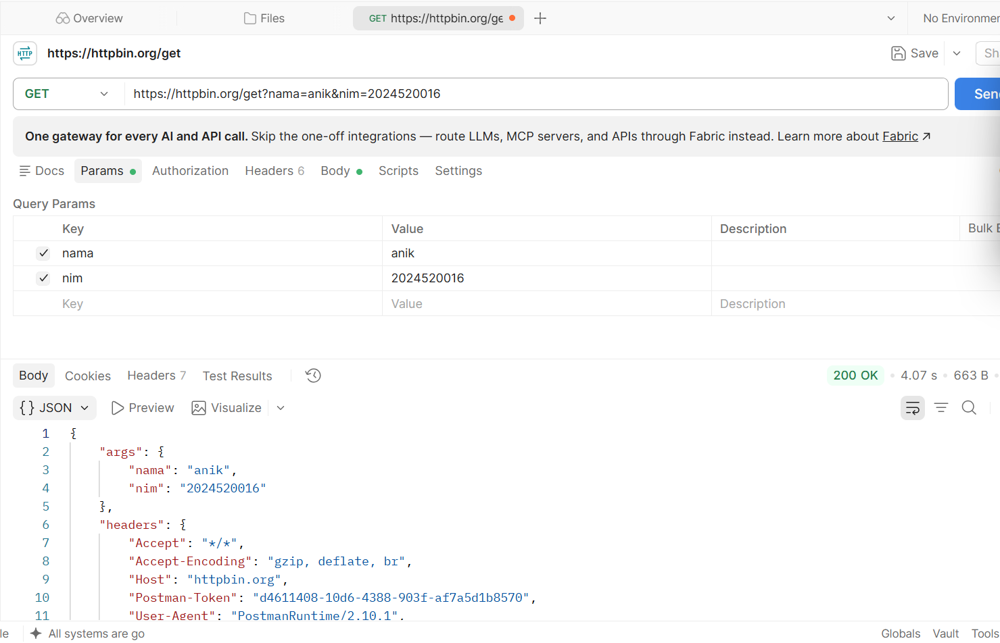
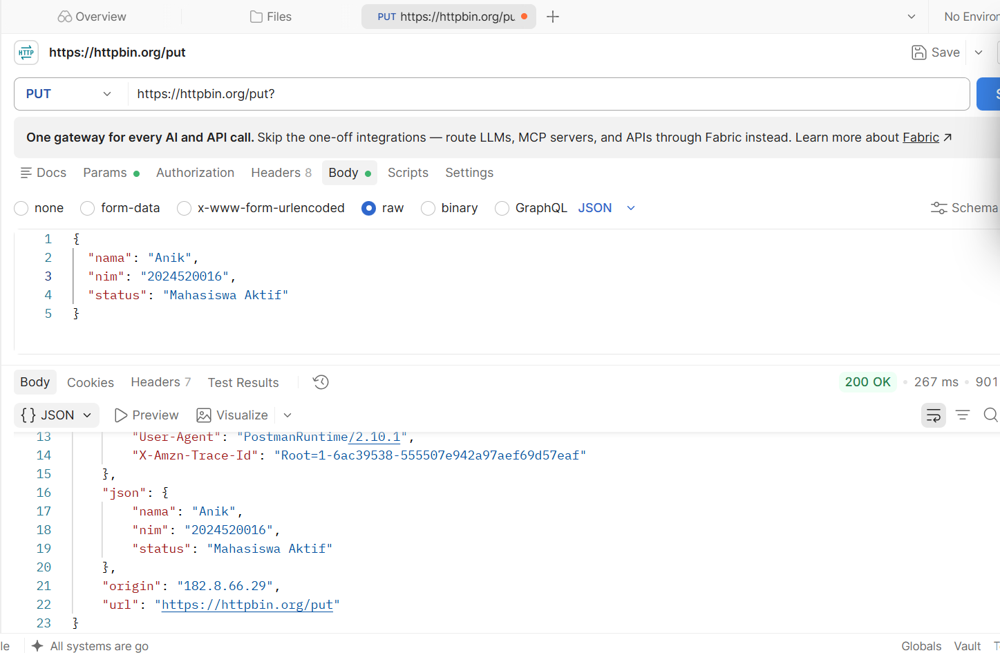
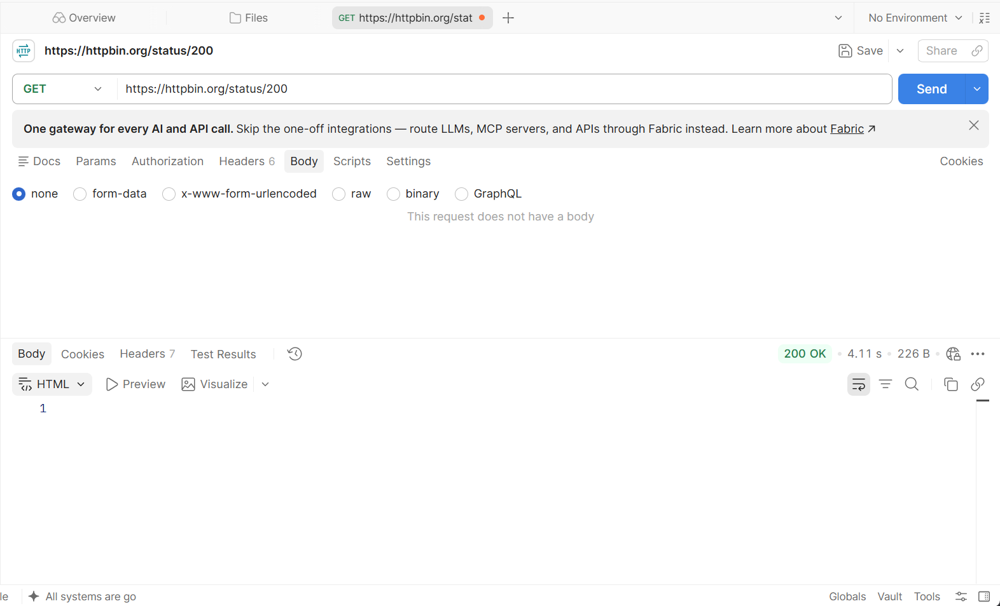
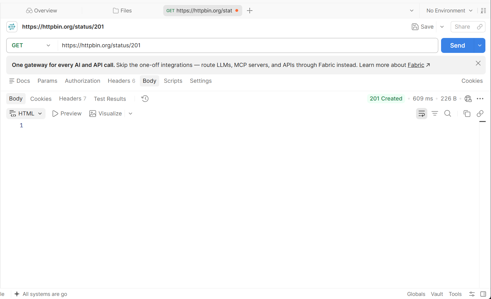
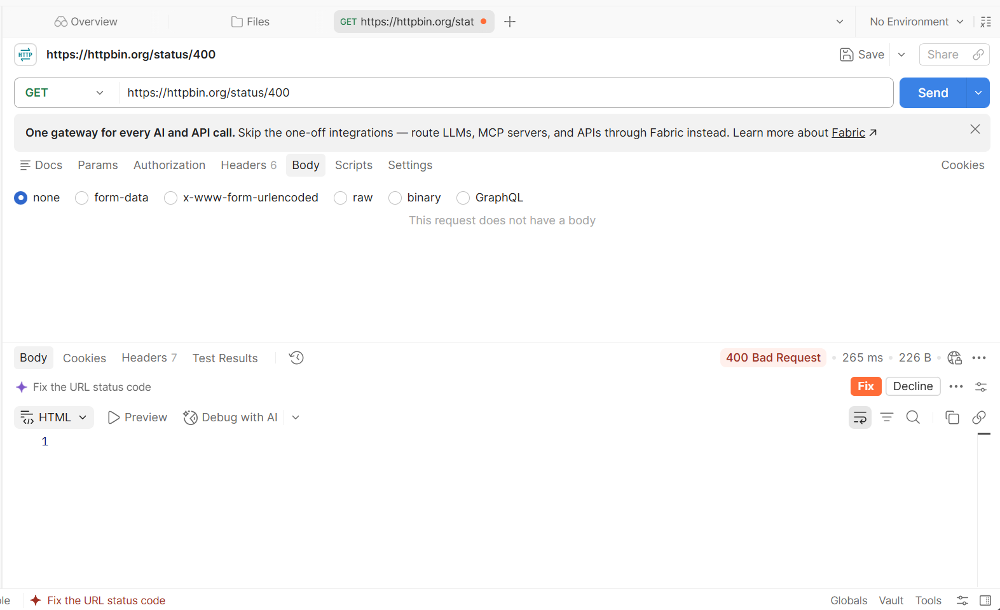
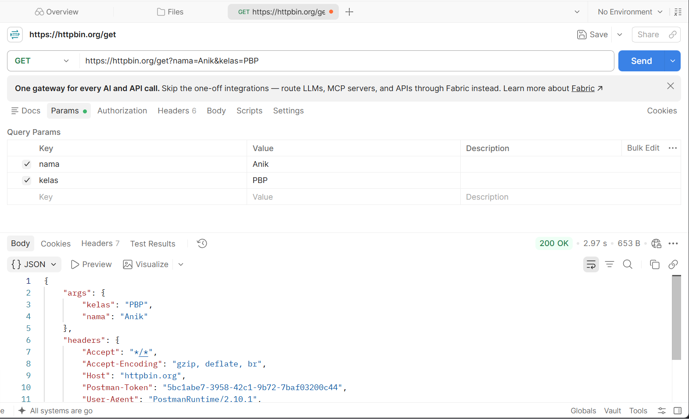
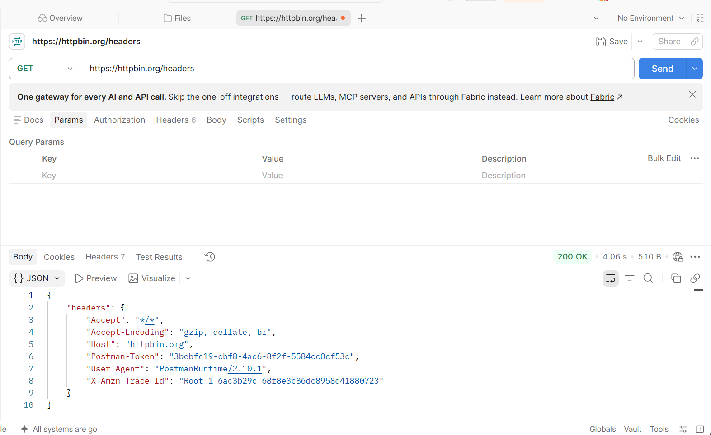

# Kegiatan Praktikum Pertemuan 02

## Judul

Pengujian HTTP Method, HTTP Status Code, Request & Response, serta Pengujian API menggunakan Postman, HTTPBin, dan curl

## Tujuan

Melakukan pengujian HTTP Method, HTTP Status Code, Request & Response, serta pengujian API menggunakan Postman dan curl untuk memahami proses komunikasi HTTP antara client dan server.

Pengujian dilakukan menggunakan HTTPBin sebagai layanan publik untuk melihat data request yang dikirim oleh client, memahami status code, response, HTTP header, serta membandingkan penggunaan Postman dan curl dalam melakukan pengujian API.

## Cara Menjalankan

Pengujian dilakukan menggunakan aplikasi Postman dan command line dengan langkah-langkah berikut:

1. Membuka aplikasi Postman atau terminal.
2. Membuat request HTTP sesuai dengan pengujian yang dilakukan.
3. Memasukkan URL HTTPBin.
4. Mengatur method, headers, parameter, atau request body sesuai kebutuhan pengujian.
5. Mengirim request menggunakan tombol **Send** pada Postman atau menjalankan perintah `curl` pada terminal.
6. Mengamati status code dan response yang diberikan oleh server.
7. Menyimpan screenshot hasil pengujian sebagai bukti pengerjaan.

## Hasil

### 1. Pengujian HTTP Method (TM-1)

Pengujian HTTP Method dilakukan menggunakan beberapa endpoint HTTPBin, yaitu GET, POST, PUT, PATCH, dan DELETE.

#### Pengujian GET

Request GET berhasil dikirim ke HTTPBin dan menghasilkan response dari server.

**Bukti hasil pengujian GET:**

[](./tm1-fungsi-get.png)

#### Pengujian PUT

Request PUT berhasil dikirim ke HTTPBin dan menghasilkan response dari server.

**Bukti hasil pengujian PUT:**

[](./tm1-fungsi-put.png)

### 2. Pengujian HTTP Status Code (TM-2)

Pengujian HTTP Status Code dilakukan menggunakan endpoint:

```text
https://httpbin.org/status/:code
```

Method yang digunakan adalah **GET**.

Pengujian dilakukan dengan beberapa status code untuk melihat response yang diberikan oleh server.

#### Status Code 200

[](./tm2-200.png)

#### Status Code 201

[](./tm2-201.png)

#### Status Code 400

[](./tm2-400.png)

### 3. Pengujian Request & Response (TM-3)

Pengujian Request dan Response dilakukan menggunakan dua endpoint HTTPBin, yaitu `/get` dan `/headers`.

Endpoint `/get` digunakan untuk melihat informasi request yang dikirim, termasuk query parameter. Sedangkan endpoint `/headers` digunakan untuk melihat HTTP header yang diterima oleh server.

#### Pengujian GET `/get`

Query parameter yang digunakan:

```text
nama = Anik
kelas = PBP
```

Request yang dikirim:

```text
GET https://httpbin.org/get?nama=Anik&kelas=PBP
```

Response menghasilkan status:

```text
200 OK
```

**Bukti hasil pengujian GET:**

[](./tm3-get.png)

#### Pengujian GET `/headers`

Request yang dikirim:

```text
GET https://httpbin.org/headers
```

Request tidak menggunakan query parameter maupun request body.

Response menghasilkan status:

```text
200 OK
```

**Bukti hasil pengujian Headers:**

[](./tm3-get-headers.png)

### 4. Pengujian API dengan Postman dan curl (TM-4)

Pengujian API dilakukan menggunakan dua alat, yaitu **Postman** dan **curl**. Pengujian menggunakan HTTPBin dilakukan untuk memahami perbedaan request menggunakan Postman dan command line serta melihat informasi HTTP response.

Pengujian yang dilakukan meliputi:

- GET menggunakan Postman.
- POST menggunakan Postman.
- GET menggunakan `curl -i`.
- Pengujian status `404` menggunakan `curl -i`.
- GET menggunakan `curl -s`.
- Perbandingan antara `curl -s` dan `curl -i`.

#### 4.1 Pengujian GET Menggunakan Postman

Request:

```text
GET https://httpbin.org/get
```

Request tidak menggunakan query parameter dan request body.

Request berhasil diproses dengan status:

```text
200 OK
```

Karena tidak menggunakan query parameter, bagian `args` pada response bernilai kosong.

#### 4.2 Pengujian POST Menggunakan Postman

Request:

```text
POST https://httpbin.org/post
```

Data JSON yang dikirim:

```json
{
  "nama": "Anik",
  "prodi": "Informatika"
}
```

Request berhasil diproses dengan status:

```text
200 OK
```

Data JSON yang dikirim berhasil diterima oleh server dan ditampilkan kembali pada bagian `json` pada response.

Response juga menunjukkan bahwa request menggunakan:

```text
Content-Type: application/json
```

#### 4.3 Perbandingan Response GET dan POST

| Aspek | GET | POST |
|---|---|---|
| Endpoint | `/get` | `/post` |
| Method | GET | POST |
| Request Body | Tidak ada | JSON |
| Query Parameter | Tidak ada | Tidak ada |
| Data pada Response | `args` kosong | Data muncul pada `json` |
| Content-Type | Tidak digunakan untuk body | `application/json` |
| Status | 200 OK | 200 OK |

Perbedaan utama adalah GET pada pengujian ini tidak mengirimkan data melalui request body, sedangkan POST mengirimkan data JSON melalui request body. HTTPBin kemudian menampilkan kembali data yang diterima pada response.

#### 4.4 Pengujian `curl -i /get`

Perintah yang digunakan:

```bash
curl -i https://httpbin.org/get
```

Hasil pengujian menunjukkan:

```text
HTTP/1.1 200 OK
Content-Type: application/json
```

Response body berisi informasi request yang diterima oleh server, termasuk `args`, `headers`, `origin`, dan `url`.

**Hasil Pengamatan:**

Perintah `curl -i` menampilkan HTTP response header dan response body. Dari hasil pengujian terlihat status `200 OK`, `Content-Type: application/json`, serta informasi header response lainnya.

#### 4.5 Pengujian `curl -i /status/404`

Perintah yang digunakan:

```bash
curl -i https://httpbin.org/status/404
```

Hasil pengujian menunjukkan:

```text
HTTP/1.1 404 NOT FOUND
Content-Type: text/html; charset=utf-8
Content-Length: 0
```

**Hasil Pengamatan:**

Server mengembalikan status `404 NOT FOUND`. Nilai `Content-Length: 0` menunjukkan bahwa response tidak memiliki isi body.

#### 4.6 Pengujian `curl -s`

Perintah yang digunakan:

```bash
curl -s https://httpbin.org/get
```

Hasil pengujian menampilkan response body dalam format JSON.

**Hasil Pengamatan:**

Perintah `curl -s` menjalankan curl dalam mode silent sehingga output tambahan dari curl tidak ditampilkan. Response body dapat ditampilkan dengan lebih bersih pada terminal.

#### 4.7 Perbandingan `curl -s` dan `curl -i`

Perintah:

```bash
curl -s https://httpbin.org/get
```

digunakan untuk menjalankan curl dalam mode silent, sehingga output tambahan dari curl tidak ditampilkan dan response body dapat ditampilkan dengan lebih bersih.

Sedangkan:

```bash
curl -i https://httpbin.org/get
```

menampilkan HTTP response header sekaligus response body.

Opsi `-s` dapat digunakan ketika hanya membutuhkan isi response, misalnya saat melakukan pengujian API atau memproses hasil menggunakan script.

Opsi `-i` digunakan ketika membutuhkan informasi HTTP seperti status code, `Content-Type`, dan `Content-Length` untuk melakukan pemeriksaan atau debugging response server.

#### 4.8 Fungsi Opsi curl

| Opsi | Fungsi |
|---|---|
| `-s` | Menjalankan curl dalam mode silent sehingga output tambahan seperti progress meter tidak ditampilkan. |
| `-i` | Menampilkan HTTP response header sebelum response body. |

Contoh penggunaan:

```bash
curl -s https://httpbin.org/get
```

Digunakan ketika ingin mendapatkan response body dengan output yang lebih bersih.

```bash
curl -i https://httpbin.org/get
```

Digunakan ketika ingin melihat informasi HTTP response header sekaligus response body.

## Lokasi Bukti

Bukti screenshot hasil pengujian disimpan pada folder:

```text
pertemuan-02/kegiatan-praktikum/
```

### Bukti TM-1

- [tm1-fungsi-get.png](./tm1-fungsi-get.png)
- [tm1-fungsi-put.png](./tm1-fungsi-put.png)

### Bukti TM-2

- [tm2-200.png](./tm2-200.png)
- [tm2-201.png](./tm2-201.png)
- [tm2-400.png](./tm2-400.png)

### Bukti TM-3

- [tm3-get.png](./tm3-get.png)
- [tm3-get-headers.png](./tm3-get-headers.png)

### Bukti TM-4

- [tm4-pengujian-404-diterminal.png](./tm4-pengujian-404-diterminal.png)
- [tm4-pengujian-curl-s.png](./tm4-pengujian-curl-s.png)
- [tm4-pengujian-get-dipostman.png](./tm4-pengujian-get-dipostman.png)
- [tm4-pengujian-get-diterminal.png](./tm4-pengujian-get-diterminal.png)
- [tm4-pengujian-post-dipostman.png](./tm4-pengujian-post-dipostman.png)

## Laporan Tugas

### TM-1 — HTTP Method

[`tugas-mandiri-1-http-method.md`](../tugas-mandiri/backend/tugas-mandiri-1-http-method.md)

### TM-2 — HTTP Status Code

[`tugas-mandiri-2-status-kode.md`](../tugas-mandiri/backend/tugas-mandiri-2-status-kode.md)

### TM-3 — Request & Response

[`tugas-mandiri-3-request-response.md`](../tugas-mandiri/backend/tugas-mandiri-3-request-response.md)

### TM-4 — Pengujian API dengan Postman dan curl

[`tugas-mandiri-4-postman-curl.md`](../tugas-mandiri/backend/tugas-mandiri-4-postman-curl.md)

## Kesimpulan

Berdasarkan seluruh kegiatan praktikum, dapat dipahami bahwa HTTP method, HTTP status code, request, response, HTTP header, serta tools pengujian seperti Postman dan curl memiliki peran penting dalam komunikasi antara client dan server.

Pengujian HTTP Method menunjukkan penggunaan GET, POST, PUT, PATCH, dan DELETE. Pengujian HTTP Status Code menunjukkan bahwa server dapat memberikan response dengan berbagai status code sesuai request yang dilakukan.

Pengujian Request dan Response menunjukkan bahwa query parameter dan HTTP header merupakan bagian dari request yang dapat diterima dan ditampilkan oleh server. Sementara itu, pengujian menggunakan Postman dan curl menunjukkan bahwa kedua tools tersebut dapat digunakan untuk melakukan request API dan melihat response dari server.

Perintah `curl -s` digunakan ketika hanya membutuhkan response body dengan output yang lebih sederhana, sedangkan `curl -i` digunakan ketika ingin melihat HTTP response header sekaligus response body.